# 깃든 (Gitden)

## 한 줄 소개

- 주니어 개발자에게 맞는 GitHub Repository·Issue를 추천하고, 근거 기반 AI 코칭과 실제 Git 실행 흐름(Fork → Clone → 학습 → Commit/PR → 상태 추적)을 통해 첫 오픈소스 기여를 완주하도록 돕는 AI 웹 서비스. SSAFY 15기 공통 프로젝트 수상작.

## 기본 정보

| 항목 | 내용 |
| --- | --- |
| GitHub | 비공개 (SSAFY 15기 소스코드 반출·공개 금지 규정) |
| 기간 | 2026-07-13 ~ 2026-08-12 (약 1개월) |
| 형태 | 팀 프로젝트 (SSAFY 15기 공통 프로젝트, 6인 팀) — 수상작 |
| 역할 | 팀장 · 기획 겸 풀스택(AI Service 초기 구현, Backend 정책, Frontend UX 개편, 문서 정합화, dev 브랜치 통합 리드) |
| 팀 구성 | 오세진(본인) + 팀원 5인 (FE, BE, AI, Infra, UI/UX 역할 분담) |
| 주요 기술 | React 19, Vite, TypeScript / Java 21, Spring Boot / Python 3.12, FastAPI / PostgreSQL, Redis / Docker Compose, Jenkins, Blue-Green 배포 |

> 이 문서는 소스코드를 인용하지 않는다. 대신 발표 준비 과정에서 팀이 스스로 정리한 설계 근거·트레이드오프·정직하게 인정한 한계를 서술적으로 풀어, 코드를 볼 수 없는 대신 "왜 이렇게 만들었는가"를 최대한 자세히 남기는 것을 목표로 한다.

## 문제 정의

### 오픈소스 기여, 가치는 분명한데 왜 어려운가

오픈소스 기여는 실전 협업 방식을 배우고, 실제 코드베이스에 흔적을 남기고, 경험 있는 개발자에게 직접 피드백을 받을 수 있는 흔치 않은 기회다. 그런데 이 가치가 분명한데도 주니어에게는 유독 진입 장벽이 높다는 점에 팀은 주목했다. 문제를 셋으로 쪼갰다.

1. **탐색 문제** — GitHub에는 오픈소스와 이슈가 방대해서, 지금 내 실력으로 손댈 수 있는 이슈를 찾는 것 자체가 곤란하다. `good first issue` 라벨이 붙어 있어도 커뮤니티가 사실상 죽어 있는 저장소가 섞여 있고, 반대로 눈에 잘 띄는 대형 저장소는 좋은 이슈가 뜨자마자 다른 사람이 먼저 채간다.
2. **이해 문제** — 이슈를 그대로 AI에 넣으면 답은 바로 나오지만, 왜 그 답이어야 하는지는 배우지 못한다. "정답을 받는 것"과 "기여할 수 있게 되는 것"은 다른 문제라고 판단했다.
3. **동기 문제** — 기여를 한 번으로 끝내지 않고 계속 이어가게 만드는 동기 장치가 없다.

### 큐레이션 철학 — "많이 보여주기"가 아니라 "실제로 잡을 수 있는 것만 남기기"

인기 저장소의 `good first issue`는 노출되자마자 선점되는 구조다. 그래서 깃든은 저장소 스타 상한·이슈 기간 창으로 후보 자체를 좁히고, 활동성이 높다고 기여 수용성이 높은 것은 아니라는 점을 실제 데이터로 확인한 뒤(메인 브랜치는 매일 커밋되지만 입문자용 라벨 이슈는 1~2년째 방치된 저장소가 실제로 있었다) 대형 유명 저장소를 의도적으로 배제했다. AI가 정답 코드를 대신 작성해 주는 대신, 근거(Evidence)와 질문·Hint로 사용자 스스로 판단하게 만들어 "학습이 남는 기여"를 지향했다.

### 주제를 정한 과정

오픈소스 온보딩 외에 통근시간 콘텐츠 편성, 릴스 형식 추천, 위치기반 유기동물 만보기, 과대광고 판별기까지 총 5개 후보를 공통 체크리스트(문제가 명확한가, AI 없이는 대체 불가능한가, 기간 내 구현 가능한가, 필요한 외부 데이터를 실제 API로 안정적으로 확보할 수 있는가, 완료 이후 재방문 동기가 있는가)로 비교했다. 다른 후보들은 외부 데이터 접근이 막혀 있거나(SNS 크롤링 제한, 인증 연동 불가) 재방문 동기가 약해 탈락했고, 오픈소스 온보딩은 GitHub API로 데이터를 안정적으로 확보할 수 있다는 점이 결정적이었다.

기획 초기에는 AI 후보 기능 하나하나를 "AI가 아니면 정말 안 되는가"로 검증했다. 사용자 프로필 생성은 GitHub API 집계와 선택형 입력만으로 충분해 AI가 거의 불필요하다고 판정했고, 끝까지 AI가 필요하다고 남은 것은 "이슈를 이해하기 쉽게 풀어주는 것"과 "어디를 고쳐야 하는지 코드 위치를 짚어주는 것" 두 가지뿐이었다. 이 원칙은 최종 구현까지 그대로 이어져, 추천 순위는 100% 규칙 기반 점수로 계산되고 AI는 근거 설명·질문·힌트 생성에만 관여한다.

### 페르소나

오픈소스 기여 경험을 축으로 4개 페르소나(첫 기여 준비형 · AI 의존 탈피형 · 과정 단축형 · 이동 중 탐색형)로 나눴고, 이 구분이 그대로 기능 설계로 이어졌다. 숙련자를 위해 이미 익숙한 단계는 건너뛸 수 있게 했고, 이동 중 탐색형을 위해 PWA와 계정 기반 이어하기를 만들었다.

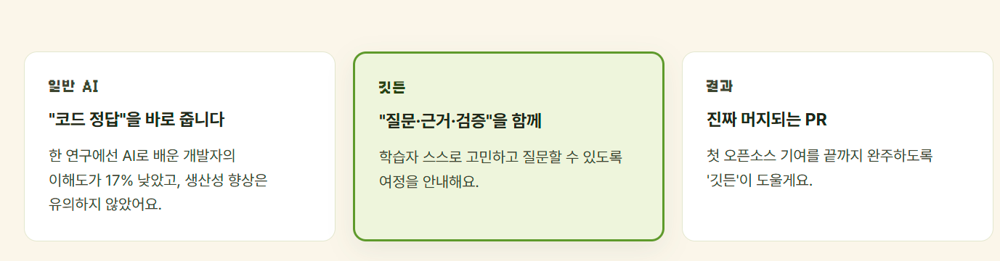
*"코드 정답을 바로 준다"가 아니라 "질문·근거·검증을 함께"한다는 차별점을 랜딩 페이지에서부터 명시했다.*

## 주요 기능

- GitHub OAuth 로그인 및 온보딩 설문(6문항) 기반 프로필 확정
- 100점 만점 규칙 기반 스코어링으로 산출한 큐레이션 Issue/Repository 추천(상위 50건, Repo당 최대 2개로 다양화)
- Journey 실행 화면: Fork·Clone 가이드, Repo/Issue Brief, 질문형 AI Coach(대안 비교·Hint)
- Commit/PR 등록 보조(PR 설명 초안: What/Why/How tested/Fixes)
- PR 상태 Monitoring(진행 중엔 실시간에 가깝게, 이탈 후엔 배치 동기화)
- 성장 기록(XP·Level)과 "나의 기여" History
- Responsive Web + PWA(Lite 설치 지원), 모바일에서는 로컬 환경이 필요한 Clone·PR만 "PC에서 이어하기"로 안내

### 화면 미리보기

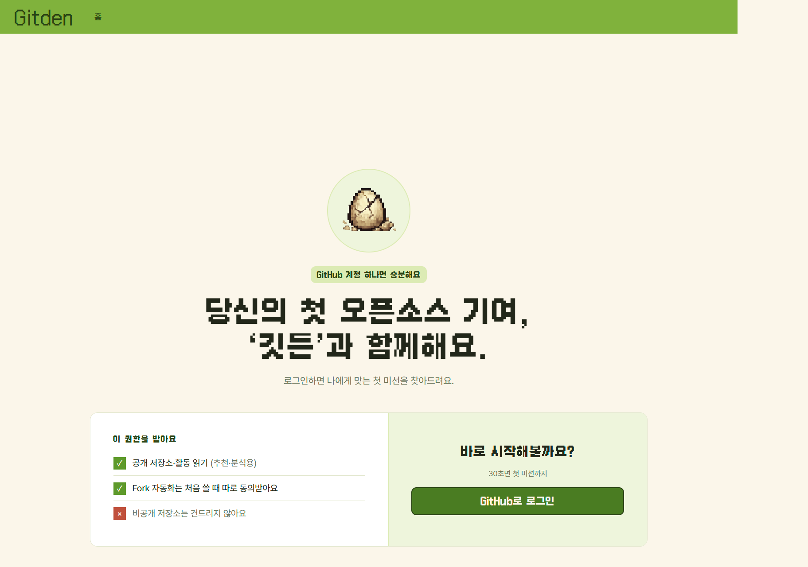
*요청 권한과 "비공개 저장소는 건드리지 않는다"는 제한을 로그인 전에 먼저 보여준다.*

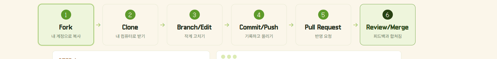
*Journey는 Fork부터 Review/Merge까지 6단계로 쪼개, 지금 어디에 있는지 항상 보여준다.*

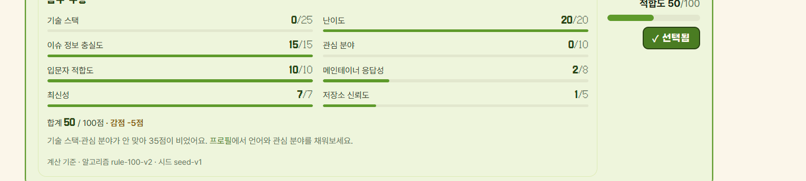
*추천 점수를 숨기지 않고 8개 항목 가중합을 그대로 노출해, 왜 이 이슈가 추천됐는지 근거를 준다.*

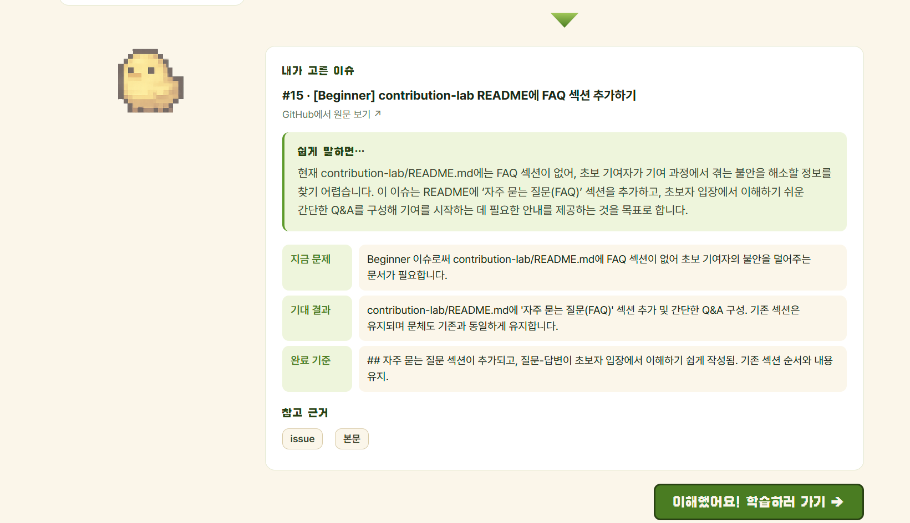
*Repo/Issue Brief는 원문 이슈를 "지금 문제 · 기대 결과 · 완료 기준"으로 구조화해 보여준다.*

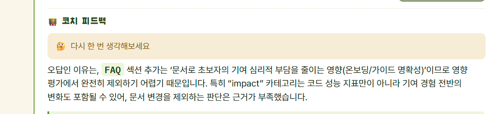
*AI Coach는 정답만 알려주지 않고, 오답을 골랐을 때도 근거를 들어 다시 생각해보게 한다.*

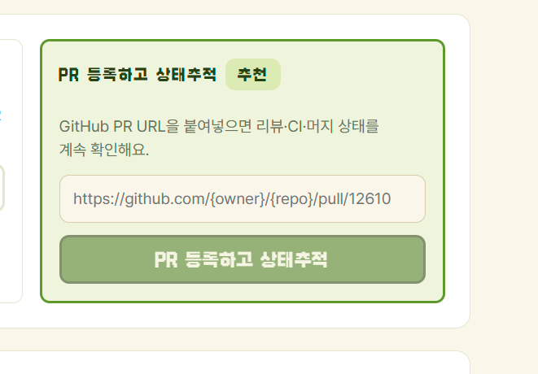
*PR을 등록하면 그 이후 리뷰·CI·머지 상태를 계속 추적할 수 있다.*

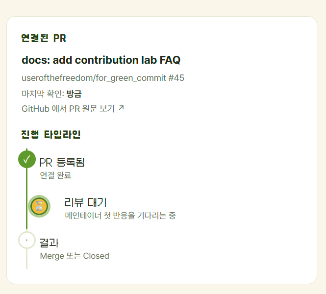
*진행 타임라인으로 지금 PR이 어느 단계인지 한눈에 보여준다.*

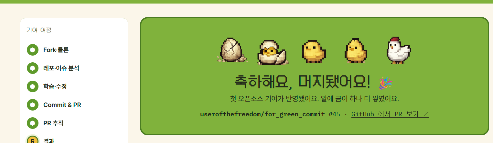
*첫 기여가 머지되면 캐릭터가 성장하는 축하 화면으로 마무리된다.*

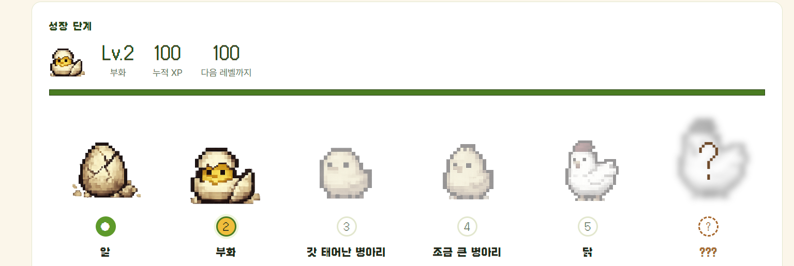
*"나의 기여" 페이지는 누적 기여를 알에서 닭까지 이어지는 성장 단계로 시각화한다.*

## 아키텍처

모노레포 구조로 `apps/{frontend, backend, ai-service}`와 `infra/`를 함께 관리했다.

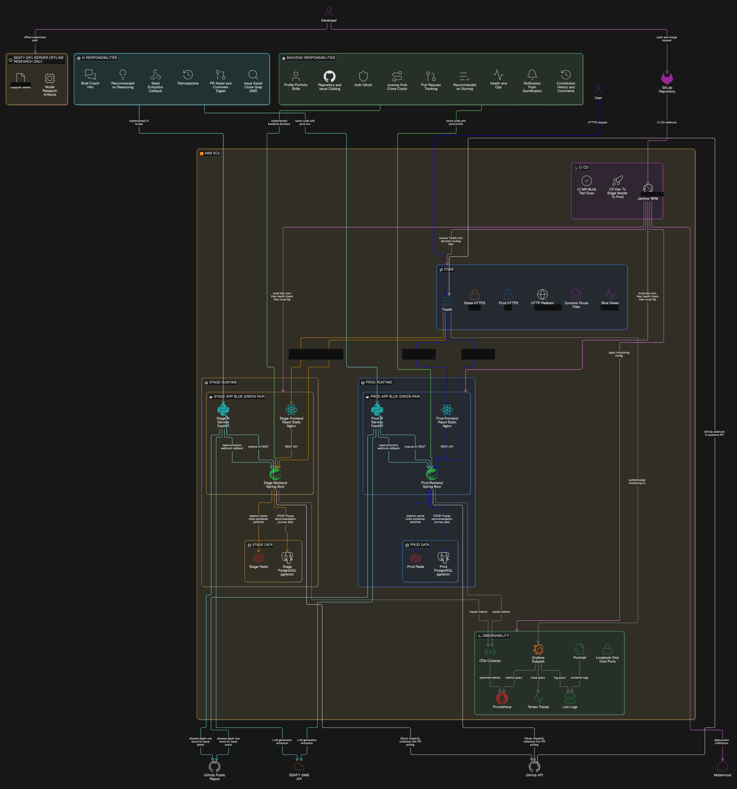
*Stage/Prod를 Blue-Green 페어로 분리하고, Edge(Traefik)가 트래픽을 무중단으로 전환한다. 실제 배포 포트 번호는 반출 규정에 따라 가렸다.*

- **Frontend (React 19 + Vite + TypeScript)**: 18개 화면, react-router-dom v7 + TanStack Query, 백엔드 OpenAPI 스펙에서 API 클라이언트를 자동 생성하는 파이프라인을 구성해 스펙과 프론트 호출부의 드리프트를 줄였다.
- **Backend (Java 21 + Spring Boot)**: 도메인 주도로 인증/추천/Journey/PR/AI연동/게이미피케이션 등 14개 도메인을 수직 분할. GitHub OAuth는 Access Token이 아닌 GitHub 사용자 ID를 기준으로 회원을 식별하도록 설계했고, Prometheus/Grafana/Loki/Tempo로 관측성을 갖췄다.
- **AI Service (Python 3.12 + FastAPI)**: Brief/Coach/Hint/추천 reasoning/PR 작성 보조를 담당하는 순수 텍스트 생성 계층. Fork/Clone/PR 같은 부작용(side effect)은 절대 직접 실행하지 않고 전부 Backend가 통제하도록 책임을 분리했다. 배포 LLM 제공자는 SSAFY 교육 인프라의 게이트웨이 하나를 사용했고, 장애 시 정적 Fallback으로 전환해 AI 없이도 핵심 여정이 완주되도록 설계했다.
- **Infra**: Docker Compose를 데이터/앱/Edge/Observability 스택으로 분리하고, Blue/Green 무중단 배포 파이프라인(헬스체크 → 트래픽 전환 → 라이브 smoke test, 실패 시 자동 롤백)을 Jenkins CI/CD와 연동했다.

## 추천 시스템 상세

발표 준비 과정에서 가장 많은 질문을 받을 것으로 예상하고 팀이 스스로 파고든 부분이라, 별도 절로 자세히 남긴다.

### 3단계 파이프라인

추천은 수집 → 분석 → 서빙 3단계로 나뉜다. **수집**은 배치가 주기적으로 GitHub 검색 규칙 기반 후보(저장소·이슈)를 모으고, **분석**은 신규 이슈를 일단 "대기" 상태로만 저장해 두고 유료 AI 호출은 사용자가 실제로 그 저장소를 열 때 또는 정해진 상한 안에서 미리 데워둘 때만 발생시키며, **서빙**은 요청 시점에 미리 쌓아둔 결과에 규칙 점수만 계산해 응답한다. 사용자와 무관하게 발생하는 비용은 전부 배치 단계가 미리 흡수하는 구조라, 요청 경로에는 무거운 분석이 새로 시작되지 않는다.

### 저장소는 해시로, 이슈는 값으로

저장소는 실제로 AI에 보내는 필드만 모아 해시로 비교해 재추출 여부를 판단한다(별표·포크 수처럼 AI 결과에 영향이 없는 값은 애초에 해시 계산에서 뺐다). 이슈는 해시가 아니라 필드 직접 비교를 쓴다. 정상 운영 상태에서는 200건을 대조해 1건만 실제로 재추출이 발생하는 수준까지 아꼈다 — 다만 이 수치는 "개선 전후 비교"가 아니라 "정상 동작 중 관측치"다. 이 장치 덕분에 수집 주기를 하루 1회 수준에서 시간당 여러 회로 크게 늘려도 비용이 거의 늘지 않았는데, 애초에 새로 활성화되는 저장소 자체가 하루 한 자릿수 건수뿐이기 때문이다.

### 관대 정책(완화) 사다리 — 그리고 그 안에서 찾은 버그들

사용자가 지정한 선호(언어·난이도·관심 분야)로 걸렀을 때 후보가 0건이면 조건을 단계적으로 완화하는 사다리를 뒀다. 완화 순서 자체를 정책 판단으로 정했다 — 관심 분야(AI 분류 결과라 신호가 약함)를 먼저 버리고, 언어(GitHub이 준 사실이라 더 신뢰할 수 있음)를 그다음에, 난이도는 이 서비스 사용자가 전원 "첫 기여자"라는 전제 때문에 가장 마지막까지 지킨다.

이 사다리를 설계하면서 실제로 세 가지 문제를 찾아 고쳤다.

1. 예전 사다리는 3단계였고 난이도를 가장 먼저 버렸는데, 입문자 서비스에서는 정반대가 맞다는 것을 뒤늦게 깨닫고 순서를 뒤집었다.
2. 언어만 넓히는 중간 단계가 없어서, 특정 언어를 고른 사용자가 조건 하나만 안 맞아도 개인화가 한 번에 완전히 사라지는 문제가 있었다.
3. 프론트엔드의 언어 선택지 표기가 GitHub의 실제 언어 표기와 미묘하게 달라, 특정 선택지를 고른 사용자는 구조적으로 매칭이 0건이었던 결함도 있었다. 별도 변환 로직으로 고쳤다.

이런 결함들은 사용자에게 "추천이 안 나온다"가 아니라 "왜 내가 고른 게 아닌 게 나오지" 정도로만 보여서 신고되기 어렵고, 그래서 오래 남아 있었다 — 겉으로는 화면이 정상으로 보이는 실패였다는 뜻이다. 이 완화가 실제로 몇 단계까지 내려가는지를 별도 지표로 남긴 뒤에야 발견할 수 있었다.

### 점수 체계와 설명 가능성

추천 점수는 100점 만점, 8개 항목(스킬 매칭·난이도 적합·이슈 준비도·관심 분야·입문자 적합·메인테이너 응답성·신선도·저장소 신뢰도)의 가중합으로 전적으로 규칙 기반이다. AI는 순위 계산에 전혀 관여하지 않고, 이 점수를 뒷받침하는 사용자 프로필을 미리 만들어 두는 역할만 한다. 화면에는 항목별 점수를 그대로 노출해 "왜 이 이슈가 추천됐는지"를 설명 가능하게 만들었는데, 이는 임베딩 기반 유사도 추천이 주지 못하는 것이라 설계 초기부터 의도적으로 벡터 유사도 검색을 배제하고 설명 가능성을 우선한 결과다.

`good first issue` 라벨이 붙어 있어도 실제로는 응답이 없는 죽은 커뮤니티가 섞여 있다는 것을 실제 데이터로 확인하고, 라벨을 그대로 믿는 대신 실제 댓글 응답 시간을 측정해(봇 댓글은 제외) "무응답 확정"과 "아직 표본이 부족함"을 구분해 점수에 반영했다.

분석이 끝난 이슈만 계속 상위에 노출되면 새 이슈가 영원히 보이지 않는 구조적 문제가 생긴다. 점수에 보너스를 얹는 손쉬운 방법 대신, 노출 목록의 일부 자리(전체 중 약 20%)를 "아직 분석되지 않은 이슈" 전용으로 예약하는 방식을 택해 점수 체계 자체를 왜곡하지 않으면서 다양성을 확보했다.

### 발견한 신뢰성 사고 — 승격 조건과 후보 조건의 불일치

수집 파이프라인이 이슈를 분석 대상으로 올리는 기준(승격 조건)과, 실제로 화면에 보여줄 때 담당자·PR 여부를 재확인하는 기준(추천 후보 조건)이 서로 어긋나 있었다. 그 결과 유료 AI 분석까지 이미 마친 이슈 중 상당수(측정 결과 약 70%)가 사실은 이미 다른 사람이 잡은 이슈였다. 겉으로는 "정상적으로 분석 발송 성공"으로만 보이는 문제라 지표만으로는 드러나지 않았고, 실측 비교를 통해서만 발견할 수 있었다. 두 조건을 일치시키는 것으로 해결했고, 이후로는 지표를 그대로 믿기보다 정기적으로 실측해 검증하는 습관이 팀에 남았다.

### 동시성 방어

배포 특성상(Blue/Green) 서버가 여러 인스턴스로 동시에 떠 있을 수 있어, 같은 이슈가 두 번 AI로 보내지지 않도록 분산 락(1차 방어)과 "아직 아무도 보내지 않았을 때만 보낸다"는 조건부 DB 갱신(최종 방어)을 이중으로 걸었다. 락이 시간 초과로 풀려도 DB 조건 검사가 중복 처리를 막는다는 원칙은 배치 발송뿐 아니라 PR 상태 확정, 웹훅·폴링 중복 처리 등 서비스 전반에 반복해서 쓰인다.

## 학습 코치(AI Coach) 상세

### "정답을 안 주는 AI"를 시스템 레벨에서 강제한 3중 방어선

1. **경로 허용목록** — AI가 지목한 관련 파일 밖은 서버가 아예 열어주지 않는다. 접두어 비교가 아니라 정확 일치이고, 허용 목록이 비어 있으면 아무것도 열어주지 않는 fail-closed 방식이다.
2. **코드 노출 범위 상한** — 한 번에 볼 수 있는 코드는 최대 81줄로 고정했다. 처음 설계안은 "범위를 지정하지 않으면 앞 200줄을 보여준다"였는데, 이대로 두면 오히려 범위를 지정하지 않는 쪽이 더 많이 보게 되는 역설이 생겨 상한을 하나로 통일했다 — 설계 함정을 스스로 발견하고 고친 사례다.
3. **출력측 필터** — 서버가 응답을 조립하는 단계에서 정답 코드가 들어갈 필드를 물리적으로 비워서 내려보낸다. 프론트엔드 코드에는 애초에 그 필드를 읽는 로직 자체가 없다.

### 관련 파일은 어떻게 정해지나 — 검색이 좁히고 AI는 지목만

AI가 저장소를 통째로 읽고 혼자 판단하지 않는다. 저장소를 얕게 내려받아 정해진 확장자만 후보로 남기고(심볼릭 링크는 악용 우려로 제외), 이슈 본문에서 뽑은 키워드로 텍스트 검색 기반 점수를 먼저 매긴다. 이 후보를 AI가 같은 질문을 두 번 던져 답이 겹치는 것만 신뢰하는 방식(self-consistency)으로 재랭킹한다. "AI가 파일을 고른다"기보다 "결정론적 검색이 후보를 좁히고 AI는 그 안에서 지목만 한다"는 표현이 더 정확하다.

### 객관식 정답은 서버에만 있다

Coach 문항은 카테고리와 질문 문구 자체가 미리 정해져 있어 AI가 새로 만들지 않는다 — 모든 사용자가 같은 순서로 같은 질문을 받는다는 뜻이기도 하고, 사용자 수준에 따른 난이도 조정은 아직 없다는 한계이기도 하다. AI가 만드는 건 보기 4개와 정답 위치뿐이고, 이걸 이슈 단위로 며칠간 캐시해 같은 이슈를 푸는 모든 사용자가 같은 문제를 공유하게 함으로써 AI 호출을 "이슈 × 카테고리 조합 수"로 묶는다. 정답은 서버에만 있고, 사용자가 고른 인덱스만 서버로 전송돼 결정론적으로 채점된다(AI가 채점하지 않는다). 캐시가 비어 있으면 다시 생성하지 않고 거절한다 — 사용자가 실제로 본 보기와 다른 정답이 생기는 사고를 막기 위해서다.

### 스트리밍을 의도적으로 쓰지 않은 이유

Coach 응답은 "보기 4개 + 정답 인덱스 + 피드백"이 한 묶음으로 검증돼야 하는 구조화된 결과라, 글자 단위로 흘려보내면 정답에 해당하는 조각이 먼저 도착할 위험이 있다. 그래서 완성된 결과를 한 번에 검증한 뒤 응답하고, 그 결과 자체를 캐시해 두 번째 사용자부터는 즉시 응답하게 했다.

## Fork 자동화 · PR 연동 · 머지 감지 상세

### Fork 자동화의 5단계

사용자의 명시적 동의 확인(언제든 철회 가능) → 사용자 본인 GitHub 토큰 확보(서비스 자체 권한이 아니라 사용자 위임 토큰을 쓰는 이유는, 서비스 자체 권한은 앱이 설치된 저장소에만 닿아 서드파티 오픈소스를 Fork할 수 없기 때문) → 멱등성 사전 확인(이미 Fork가 있으면 새로 만들지 않고 기존 정보로 응답 — GitHub API가 이미 Fork가 있어도 오류 없이 기존 정보를 그대로 돌려주는 특성 때문에 사전 조회가 필수다) → 실제 Fork 요청(서킷 브레이커·재시도 적용) → 실패 시 수동 Fork 링크로 폴백. GitHub 쪽 복사가 실제로 완료됐는지 기다리는 폴링은 없고, 사용자가 나중에 다시 확인할 수 있는 별도 상태 조회만 제공한다는 한계는 정직하게 인정한다.

### PR 연동은 자동 감지가 아니라 사용자가 URL을 붙여넣는 방식

서버가 GitHub 이벤트를 구독해 스스로 연동을 만들어내지 않는다. 연동 시점에 여정 소유권, 중복 연동 여부, PR의 대상 저장소가 배정된 미션 저장소와 정확히 일치하는지를 검증한다. 다만 PR 작성자가 로그인한 사용자 본인인지까지 대조하지는 않는다 — 방어 우선순위를 어디에 뒀는지 보여주는 지점이라 이 문서에도 솔직히 남긴다.

### 웹훅 대신 폴링을 주 경로로 — 그리고 실제로 검증된 순간

기여 대상은 사용자의 저장소가 아니라 남의 오픈소스 저장소라, 그쪽에 깃든의 GitHub App을 설치해 달라고 요구할 수 없다(대형 오픈소스 프로젝트에 앱 설치를 요청하는 건 사실상 불가능하다). 그래서 주기적으로 서버가 GitHub에 상태를 물어보는 폴링을 주 경로로 삼고, 활동량에 따라 조회 간격을 짧게(활성)·중간(유휴)·길게(정체) 세 단계로 차등을 둬 자원을 아꼈다. 앱이 상시 연결돼 있어도 상대가 신호를 보내지 않으면 새 정보가 없는 것과 같으므로, 연결 방식 자체보다 "언제 다시 물어볼지"가 더 중요하다는 논리다. 웹훅은 앱이 설치된 소수 저장소에 대한 보조 신호로만 쓴다.

이 설계는 실전에서 그대로 검증됐다 — 배포 환경 설정 문제로 웹훅이 백엔드에 전혀 도달하지 못한 기간이 있었는데, 서비스는 멀쩡했다. 폴링이 주 경로라는 설계 판단이 실제 장애 상황에서 스스로를 증명한 사례다.

여러 PR의 상태를 한 번에 조회하는 배치 크기는 실측으로 정했다. 조회 건수를 단계적으로 늘려가며 API 비용 단위를 측정했는데, 비용 단위가 늘지 않는 구간은 훨씬 컸음에도 응답 크기(제목이 긴 PR이 몰리면 응답 크기 상한에 가까워지는 문제)가 병목이 되어 더 낮은 값에서 배치 크기를 멈췄다. "예산이 아니라 응답 크기가 병목이었다"는 걸 실측으로 확인한 사례다.

### XP·성장 기록 지급의 중복 방지

PR 머지가 감지되면 먼저 이미 기여 기록이 있는지 확인한다(1차 방어). 진짜 방어는 XP 지급 시점에 있다 — "출처 종류 · 출처 ID · 이벤트 종류" 조합에 DB 유일 제약을 걸어, 같은 조합으로 다시 지급을 시도하면 삽입 자체가 실패하게 만들었다. 애플리케이션 로직이 아니라 DB 제약이 최종 방어선이라는 점이 핵심이다. 이벤트 종류별로 점수를 고정값으로 뒀다(여정 완료 · PR 연동 · PR 머지 · 회고 반영이 각각 다른 고정 점수) — 계산식이 아니라 "검증된 이벤트에만 정해진 값을 준다"는 방식으로, 이는 아래 게이미피케이션 설계 철학과 직접 연결된다.

PR이 머지 없이 닫히면 폴링을 멈추고 "머지 없이 닫혔다"는 알림만 보낸다. 성공·실패를 클라이언트가 판단하게 두면 사후 분석에서 두 경우를 구분할 수 없기 때문에, 서버가 여정 종료 시점에 PR 연동 기록의 유무로 결과를 판정한다. 다만 닫힌 뒤 다시 열리는 경우(reopen)는 감지 경로가 없다는 한계도 있다.

## AI 신뢰성 설계 철학

파인튜닝도, 자체 학습도, 임베딩 기반 재정렬도 하지 않았다는 것을 팀은 스스로 먼저 인정했다. 그 위에서 "그럼 이 서비스에서 AI의 경쟁력은 무엇인가"를 다시 정의했는데, 답은 모델 성능이 아니라 "바꿀 수 없는 모델을 얼마나 신뢰 가능한 시스템으로 감쌌는가"에 있다는 프레이밍이었다.

1. **출력 형태를 좁혀 할루시네이션을 무력화** — 파일을 고를 때 AI는 자유 문자열이 아니라 후보 목록의 인덱스만 돌려주고, 범위 밖 값은 버린다. "이상한 말을 못 하게 검사"하는 게 아니라 "이상한 말을 할 수 있는 형식 자체를 없앤" 접근이다.
2. **근거에 출처를 타입 수준으로 강제** — 모든 근거를 GitHub 원문 / 규칙 계산 / LLM 추정으로 구분해 추정과 사실을 뒤섞지 않는다. 확신이 부족하면 별도로 표시한다. 예전에는 근거가 부족해도 항상 정해진 개수를 채워서 자신 없는 결과가 확신처럼 보이는 문제가 있었는데, 이를 인지하고 고쳤다.
3. **모델이 죽어도 서비스는 죽지 않는다** — 타임아웃·오류·스키마 불일치 시 검증된 정적 콘텐츠로 즉시 전환하고, "AI 없이 만든 결과"임을 화면에 표시한다. AI 제공자를 완전히 꺼도 핵심 여정이 끝까지 진행되는 것이 내부 수용 기준이었다.
4. **같은 모델을 얼마나 아껴 쓰는가로 승부** — 변하지 않은 입력은 재분석하지 않아 호출을 정상 상태 기준 200:1 수준으로 묶었고, 입력이 큰 두 경로만 상대적으로 저렴한 모델로 내려 단가를 크게 낮췄다. 모델 성능이 아니라 비용 구조를 엔지니어링 문제로 풀어, 별도 GPU 추론 인프라를 둘 이유 자체를 없앤 사례다. Local GPU 운영을 "나중에 검토"가 아니라 "폐기 확정"으로 문서에 명시한 것도 같은 맥락이다 — 대회 규정상 배포 서비스를 자체 GPU와 직접 연결하지 않기로 한 제약과, 비용 구조 개선으로 별도 추론 환경이 필요 없어졌다는 두 근거가 함께 있었다.

## 인프라 심화

### Blue/Green과 DB 마이그레이션 정책

데이터 스택은 색과 무관하게 한 벌만 띄우기 때문에, 배포 전환 기간 동안 신·구 버전이 같은 스키마를 동시에 봐야 한다. 그래서 컬럼 삭제·타입 변경을 금지하고 "추가만" 허용하는 마이그레이션 규칙을 세웠고, 이미 적용된 마이그레이션 파일을 나중에 수정하면 체크섬이 어긋나 배포 자체가 막히도록 CI에 하드 게이트를 걸었다.

### 무중단의 실제 범위 — 되는 것과 아직 안 되는 것을 함께 남긴다

라우팅 전환 자체(Edge 라우터가 새 색으로 트래픽을 돌리는 것)는 실제로 무중단이고, 세션도 상태 없는(stateless) 구조와 공유 저장소 덕분에 어느 색이 요청을 받아도 인증이 그대로 유지된다. 다만 전환 시점에 처리 중이던 요청을 곱게 흘려보내는(draining) 처리는 아직 없어서, 색을 내리는 순간 그 요청은 끊길 수 있다. "신규 요청 기준으로는 무중단이고, 전환 시점의 인플라이트 요청 드레이닝은 다음 개선 과제"라는 것이 가장 정확한 설명이다. 헬스체크(백엔드·AI 서비스 응답, 개발용 API가 실제로 차단됐는지 등 여러 관문)를 하나라도 통과 못 하면 새 버전을 올리지 않고 배포를 실패시키는 것이 원칙이다.

### 실제 인시던트 — staging 마이그레이션 불일치를 근거 기반으로 추적한 사례

백엔드가 아예 기동하지 못하는 장애가 발생했을 때, 처음 나온 "줄바꿈 문자 차이가 원인"이라는 진단을 그대로 받아들이지 않고 실제 체크섬 계산 로직을 직접 재현해 그 가설이 틀렸음을 증명하는 데서 조사가 시작됐다. 로그를 넓게 다시 훑어 실제 원인을 추적한 결과, 같은 파일 경로 아래 서로 완전히 다른 마이그레이션 이력 세트가 과거에 여러 벌 존재했고 staging이 그중 옛 세트로 만들어져 있었다는 진짜 원인을 찾아냈다. 이 과정에서 제안된 자동 복구 명령을 바로 실행하지 않고 판정 쿼리로 먼저 상태를 확인하도록 손을 멈췄고, 조사 중 별개로 존재하던 실제 결함(한 마이그레이션이 이전 시드 데이터의 식별자를 그대로 참조해, 그 시드가 없는 DB에서는 무조건 실패하는 문제)까지 함께 찾아 고쳤다. "인프라가 제시한 원인을 그대로 믿지 않고 실측으로 반증한 뒤 진짜 원인을 추적한" 사례로, 팀이 겪은 디버깅 경험 중 가장 근거 기반 사고에 가까웠던 순간으로 꼽는다.

### 관측성 설계 — 겨냥한 것은 "다운"이 아니라 "조용한 실패"

Prometheus·Grafana·Loki·Tempo 스택을 자체 구축했다(Blue/Green 특성상 두 색을 합쳐 집계하되, 유휴 색이 꺼져 있는 것을 장애로 오탐하지 않도록 별도로 조정했다). 알림 규칙 수십 건이 팀 채팅 채널로 전송되도록 연결했는데, 목표는 단순 다운 감지가 아니라 API는 계속 200을 응답하지만 내부적으로 저하된 상태(추천이 AI 프로필 없이 나가는 중, 배치가 오래 멈춘 상태 등)를 잡아내는 "조용한 실패" 탐지였다. 부팅 시 지표 카운터를 미리 0으로 초기화해 두는 것도, 집계 도구 특성상 값이 한 번도 기록되지 않으면 "첫 사건" 자체가 잡히지 않는 문제를 막기 위한 장치다. 다만 알림 규칙 대부분이 prod가 아닌 검증 환경에만 적용돼 있어 prod로의 확장이 남은 과제였고, 알림 채널 연결이 비어 있으면 알림 전송만 조용히 실패하는 성질도 남아 있었다는 점은 인정한다.

### 동시 실행 방지 원칙의 반복 — 우연이 아니라 설계 원칙

여러 인스턴스가 배치를 두 번 돌리지 않도록 분산 락(1차 방어)을 걸되, 락이 시간 초과로 풀려도 "아직 아무도 처리하지 않았을 때만 처리한다"는 조건부 DB 갱신(최종 방어)을 항상 함께 둔다. 이 이중 방어 패턴은 배치 실행, AI 발송, PR 상태 확정 등 서비스 전반에 걸쳐 일관되게 반복된다.

## 게이미피케이션 설계 배경

XP·레벨을 설계하기 전에 실패 사례부터 검토했다. 한 유명 오픈소스 행사가 "PR 4개 제출 시 보상 지급" 방식으로 운영하다, 사소한 오타 수정 수준의 스팸 PR이 대량으로 쏟아져 메인테이너 커뮤니티가 몸살을 앓았던 사건이 참고 사례였다. 여기서 얻은 원칙은 "양(커밋 수·PR 제출 수 같은 원시 카운트)을 보상하면 반드시 스팸이 생기고, 그런 지표는 손쉽게 조작 가능하다"는 것이다. 그래서 원시 카운트가 아니라 "여정 완료"·"PR 머지"처럼 실제로 검증된 이벤트에만 점수를 주는 방식을 택했다. 리더보드는 의도적으로 넣지 않았다(사회적 동기가 "양 기반 경쟁"으로 흐르기 쉽다고 판단) — 배지는 기준 정의가 어려워 1차 범위에서 제외했지만 데이터 구조는 남겨뒀다.

동기 설계 자체도 심리학적 근거를 참고했다. "원래 내재적 동기로 하던 일에 외적 보상을 조건부로 붙이면 흥미가 줄어든다"는 과잉정당화 효과(언더마이닝 효과) 연구를 의식해서, 보상을 "목표를 던지고 밀어붙이는 도전과제"가 아니라 "이미 한 일을 사후에 기록해서 보여주는 성장 로그"에 가깝게 설계했다.

설계 체크리스트의 첫 줄은 "이 메커니즘이 메인테이너에게 피해를 주는가? Yes면 폐기"였다. 이 원칙은 제품 전반에 여러 겹으로 스며 있다 — 담당자·연결 PR이 없는 최근 이슈만 추천 후보로 삼는 규칙 자체가, 팀원이 실제로 오픈소스 저장소를 리서치하다 "이미 담당자와 PR이 있어 기여 대상에서 제외"당한 경험에서 나왔다. 목표를 "PR을 몇 건 냈는가"가 아니라 "완주했는가"로 정의한 것도 같은 문제의식의 연장이다.

### "머지 확률"을 보여주지 않기로 한 결정

근거가 얕은 확정적 수치(예측 확률)는 신뢰를 오히려 깎는다고 판단해, 화면에는 예측 확률 대신 "리뷰 대기 중 — 메인테이너 첫 반응까지 예상 약 N시간"처럼 준비 상태와 대기 상황만 보여준다. 표본이 적은 저장소에 그럴듯한 확률을 붙이는 것 자체가 근거 없는 확신을 학습시키는 일이라는 문제의식에서 나온 결정이다.

### 프로토타입 사용자 테스트로 설계를 되돌린 사례

초기 프로토타입은 "이슈 선택 → 바로 질문"으로 곧장 넘어갔는데, 테스트에서 사용자가 사전 정보 부족을 불편해했다. 원인을 추적하니 원래 기획에 있던 "이슈를 깊이 있게 정리해 보여주는 화면(Brief)"이 구현 과정에서 누락됐던 것이었다 — 이슈 선택 → 저장소 소개 → Brief → (선택적 웜업 질문) → 학습 시작 순서로 복원했다. 새로 설계가 필요했던 문제가 아니라 이미 설계했던 걸 구현 단계에서 놓쳤던 문제였다는 점이 흥미로운 지점이다.

### 성공 기준 정의

가입자 수나 트래픽이 아니라 완주 여부와 품질 확인을 기준으로 뒀다 — 로그인부터 기록 확인까지 중단 없이 완료되는지, 노출된 이슈가 "입문자가 실제로 잡을 수 있는" 상태임을 사람이 직접 확인했는지, Coach에서 최소 한 번 이상 판단 근거를 남기는지, PR 상태 변화가 감지돼 성장 기록까지 이어지는지를 완료 기준으로 삼았다.

## 기술 스택과 사용 이유

| 기술 | 사용한 이유 |
| --- | --- |
| React 19, Vite, TypeScript | 18개 화면의 라우팅과 추천/Journey/Monitoring 등 복잡한 상태 흐름을 타입 안정적으로 구성 |
| Java 21, Spring Boot, JPA | 14개 도메인 REST API, 인증, 스케줄링 등 서비스 핵심 로직 구현 |
| Python 3.12, FastAPI, Pydantic | AI 텍스트 생성(Brief/Coach/Hint/추천 reasoning)을 Backend와 분리된 계층으로 독립 운영 |
| PostgreSQL, Redis | 정규화된 도메인 데이터 저장과 세션·캐시·분산락 처리 |
| Docker Compose, Jenkins | 로컬 재현 가능한 개발 환경과 Blue/Green 기반 무중단 배포 자동화 |

임베딩 기반 벡터 유사도나 자체 파인튜닝 모델은 의도적으로 배제했다 — 추천 점수의 설명 가능성을 우선했고(위 "추천 시스템 상세" 참고), 모델 경쟁력보다 신뢰 가능한 시스템 설계로 승부하는 방향을 택했기 때문이다(위 "AI 신뢰성 설계 철학" 참고).

## 프로젝트 규모

| 지표 | 값 |
| --- | --- |
| 총 커밋 수 | 1,303건 (팀 전체) |
| 개발 기간 | 약 1개월 (2026-07-13 ~ 2026-08-12) |
| 팀 인원 | 6명 |
| Backend REST 엔드포인트 | 68개 (14개 도메인, 테스트 클래스 214개) |
| Frontend 화면 | 18개 |
| 본인 커밋 비중 | 팀 내 약 31%(402/1,303건, 여러 커밋 계정 합산) — 팀 내 최다 기여자 |
| 본인 dev 브랜치 통합(merge) 비중 | 전체 merge 515건 중 약 29%(147건) |

## 주요 작업 흐름

| 시기 | 단계 | 작업 내용 |
| --- | --- | --- |
| 07-13 ~ 07-21 | 팀장·기획 | 팀 주제 선정 리드, MVP 범위 제안, 초기 기획서·요구사항정의서·IA·화면정의서 등 정본 문서 체계 수립 |
| 07-22 ~ 07-28 | AI Service 초기 구현 | Brief·Coach/Hint·Seed Extraction·추천 reasoning 라우터 구현, Backend 추천 스코어링 로직 구현 |
| 전 기간 반복 | 문서·스펙 정합화 | 기획서-구현 간 불일치를 주기적으로 재점검하고 DB 스키마·TODO를 정본 상태로 유지 |
| 08-06 ~ 08-09 | Frontend UX 개편 | Coach 학습 보조/문제풀이 패널 위계 정리, Tutorial 설명 보강, PR CTA 강조, 코멘트 모아보기 UI 등 |
| 전 기간 | Backend 정책 | PR 등록 시 Journey slot 해제, PR 머지 대기 저장소 보호 등 도메인 정책 구현 |
| 전 기간 | 통합 리드 | feature 브랜치를 dev로 병합하는 게이트키퍼 역할을 지속 수행 |

## 내가 작업한 것

- 팀 결성 직후(주제 선정 전)부터 팀장으로서 협업 도구 학습과 팀원 성향·목표 파악을 병행하며 역할 분담을 준비했다.
- 주제 확정 회의를 리드하며 5개 후보를 공통 체크리스트(문제 명확성 · AI 필요성 · 기간 내 구현 가능성 · 외부 API 확보 가능성 · 재방문 동기)로 비교해 오픈소스 온보딩으로 좁혔다.
- 서비스기획서 초안을 직접 작성해 팀 피드백을 받고 반영하는 과정을 반복했고, 이후 ERD·Wireframe·RFP·AI Architecture 등 세부 문서 작성 역할을 팀원별로 분담시켰다. 요구사항정의서·IA 등 정본 문서 체계도 함께 수립했다.
- Jira를 1차로 셋업(공간·흐름 구성)한 뒤 Epic/Story/Task 단위로 고도화하는 2단계 작업을 직접 수행했다.
- 기획 초기(팀 결성 3일차)부터 "AI가 전체 프로세스를 어떻게 조율할지, 어떤 판단을 LLM과 로컬 모델로 나눌지"를 구조적으로 고민해 기록해 뒀고, 이 고민은 이후 실제 구현에서 "Local GPU는 배포 서비스와 분리한다"는 결론으로 이어졌다. 같은 시기 기획 문서에 "기여 여정 각 단계는 스킵 가능해야 한다", "Fork·Clone은 자동화 옵션을 제공한다", "PR 수락 여부를 주기적으로 확인한다"를 이미 명시해 뒀는데, 이는 이후 실제로 구현된 폴링 기반 PR 모니터링과 Fork 자동화 동의 흐름으로 그대로 이어졌다.
- AI Service 초기 라우터(Brief/Coach·Hint/Seed Extraction/추천 reasoning)와 Backend 추천 스코어링 로직 구현에 관여했다.
- 개발 기간 내내 기획-구현 간 불일치를 점검·정리해 문서를 "정본" 상태로 유지하는 역할을 반복 수행했다.
- Frontend UX 개편(Coach/Tutorial 패널 위계, PR CTA, 코멘트 UI 등)과 Backend PR·Journey 관련 정책 구현에 참여했다.
- feature 브랜치의 dev 통합을 지속적으로 담당해 팀 전체 merge의 약 29%를 처리했다.
- 파일 경로 기준으로는 Backend > Frontend > AI Service > 문서 순으로 고르게 관여해, 특정 레이어에 국한되지 않는 풀스택 + PM성 기여를 했다.

## 정직하게 인정하는 한계

발표를 준비하며 팀이 스스로 정리해 둔 미완성·부채 목록이다. 좋게만 포장하지 않기 위해 그대로 옮긴다.

- 프론트엔드 자동화 테스트가 없다. 백엔드는 단위·통합·실제 GitHub 호출 검증까지 3층으로 갖췄지만, 프론트는 사람이 시연 경로로 확인하는 수준에 머물렀다 — 기록과 판정 로직이 걸린 백엔드에 우선순위를 두고 화면 검증은 나중으로 미룬 판단이었지만, 명백한 기술 부채로 인정한다.
- 브라우저 푸시 알림은 구독 저장 API까지만 있고 실제 발송 로직은 없다. 앱 내 알림함은 동작하지만 "브라우저를 꺼도 알림이 온다"는 아직 사실이 아니다.
- 자동 DB 백업과 읽기 복제본이 없다. 대회 기간이라는 규모에서 감수한 판단으로 남겨두고, 다음 과제로 명시해 둔다.
- 배포 롤백이 항상 "즉시"는 아니다. 배포 진행 중 실패라면 색 전환만 되돌리면 되어 빠르지만, 이미 이전 버전을 완전히 내린 뒤라면 다시 배포하는 절차가 필요해 수 분이 걸린다.
- PR이 머지 없이 닫힌 뒤 다시 열리는 경우(reopen)를 감지하는 경로가 없다.
- 추천 품질을 정량적으로 검증할 기준 데이터(Gold Set)가 없다. 설계 근거(선점 이슈 제외, 메인테이너 응답성 실측, 난이도를 마지막까지 지키는 완화 순서)로 방향을 설명할 수는 있지만, "정확도 몇 %"라는 숫자로는 답할 수 없다.
- 로그에서 개인정보(이름·이메일)를 자동으로 걸러주는 마스킹 도구는 없고, 식별자 중심으로 남기는 규칙과 리뷰로 지키는 수준이다.
- 배포 전환 시점의 인플라이트 요청 드레이닝이 없어, 색을 내리는 순간 그 요청은 끊길 수 있다.

이 목록을 스스로 정리해 뒀다는 사실 자체가, "우리가 이런 문제까지 이미 파악하고 있다"는 근거로 발표에서도 유용하게 쓰였다.

## 배운 점

- 팀장으로서 기획-구현 간 정합성을 지속적으로 관리하는 것이 기능 구현 자체보다 더 많은 노력이 든다는 점, 그리고 정본 문서 체계를 초반에 세워두면 반복 점검 비용이 크게 줄어든다는 점.
- AI를 서비스에 통합할 때는 "무엇을 할 수 있는가"보다 "무엇을 하지 못하게 막을 것인가"(부작용 차단, Fallback, 근거 태깅, 출력 형태를 좁혀 할루시네이션을 무력화하는 것)를 먼저 설계해야 신뢰할 수 있는 제품이 된다는 점.
- 외부 시스템(GitHub) 연동에서 이상적인 이벤트 기반 설계가 항상 가능한 것은 아니며, 제약을 인정하고 폴링 같은 대안을 조합하는 절충이 실무적으로 더 중요할 때가 많다는 점 — 그리고 그 판단이 실제 장애 상황에서 옳았음이 증명되는 경험은 흔치 않다는 점.
- 겉으로 정상처럼 보이는 실패(추천 사다리가 조용히 개인화를 지워버리는 것, 지표가 "정상 발송 성공"으로만 보이던 신뢰성 사고 등)가 가장 오래 남는 버그라는 점, 그리고 이런 실패는 관측 지표를 미리 심어두지 않으면 발견 자체가 불가능하다는 점.
- 인프라 장애 상황에서 첫 번째로 제시된 원인 진단을 그대로 믿지 않고, 직접 재현해서 반증한 뒤 진짜 원인을 추적하는 태도가 사고 해결 시간보다 오히려 더 중요할 때가 있다는 점.
- 게이미피케이션처럼 사람의 행동을 유도하는 장치는 반드시 악용 사례(스팸, 과잉정당화 효과)를 먼저 조사한 뒤 설계해야 한다는 점.
- 6인 팀에서 기획·AI·Backend·Frontend·통합을 넘나들며 작업하니, 한 레이어 전문성보다 전체 흐름을 조율하는 역할의 가치를 체감했다.

## 어려웠던 점과 해결

- 기획서와 실제 구현이 시간이 지나며 계속 벌어지는 문제 → 정본 문서 체계를 만들고 프로젝트 전 기간에 걸쳐 정기적으로 재점검하는 프로세스로 대응했다.
- PR 상태를 실시간처럼 보여주고 싶은데 외부 저장소에는 Webhook을 걸 수 없는 제약 → 활동량에 따라 조회 간격을 차등화한 폴링을 주 경로로 채택했고, 실제 웹훅 장애 상황에서 이 설계가 옳았음이 증명됐다(위 "Fork 자동화 · PR 연동 · 머지 감지 상세" 참고).
- AI 응답의 신뢰성과 호출 비용을 동시에 관리해야 하는 문제 → 원본 변경 감지(해시·값 비교)로 불필요한 호출을 막고, 장애 시 정적 Fallback으로 전환하는 구조를 도입했다(위 "AI 신뢰성 설계 철학" 참고).
- 추천 개인화가 조건 완화 사다리 안에서 조용히 사라지는 문제, 언어 표기 불일치로 특정 사용자군의 매칭이 구조적으로 0건이었던 결함 → 완화 단계별 지표를 심어 발견하고, 순서 재조정과 표기 변환 로직으로 해결했다(위 "추천 시스템 상세" 참고).
- staging 환경 마이그레이션 불일치로 백엔드가 기동하지 못한 장애 → 처음 제시된 원인을 그대로 믿지 않고 직접 재현해 반증한 뒤, 로그를 넓게 추적해 진짜 원인(과거 마이그레이션 이력 세트 불일치)을 찾아 해결했다(위 "인프라 심화" 참고).

## 다음 개선 방향

- 실사용자 테스트를 통해 온보딩·추천 단계에서의 이탈 지점을 구체적으로 수집
- GitHub App 설치가 가능한 저장소 범위를 넓혀 Webhook 기반 실시간성을 일부 보완
- Knowledge Graph 기반 추천, Orchestrator 고도화 등 대회 기간 내 미루었던 확장 계획 검토
- FE→BE→AI 전체 분산 추적(Observability) 계측을 앱 레벨까지, 그리고 알림 규칙을 prod 환경까지 확장
- 프론트엔드 자동화 테스트 도입, 배포 전환 시점의 인플라이트 요청 드레이닝, 자동 DB 백업·읽기 복제본 등 스스로 인정한 기술 부채 해소
- 추천 품질을 검증할 기준 데이터(Gold Set) 구축과 정량 지표 확립
- PR reopen 감지, 브라우저 푸시 실제 발송 로직 등 미완성 기능 완성

## 비고

- 이 프로젝트는 SSAFY 15기 공통 프로젝트로 소스코드 저장소의 반출·공개가 규정상 금지되어 있어, 이 문서는 실제 코드 대신 문제 정의·아키텍처 개념·설계 트레이드오프·정량 지표·본인 역할과 배운 점을 중심으로 서술했다. 발표를 준비하며 팀이 스스로 정리한 설계 근거와 한계 목록을 참고해, 코드를 보여줄 수 없는 대신 "왜 이렇게 만들었는가"를 최대한 자세히 남기는 데 집중했다.
